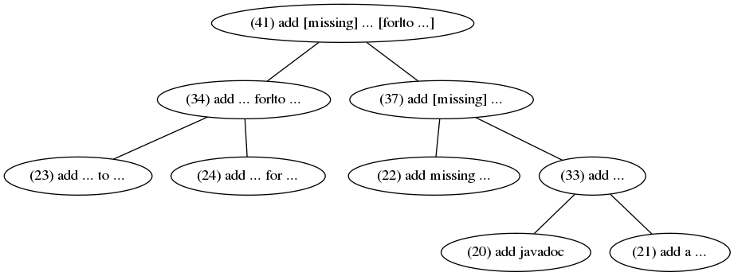

# Revisiting Learning-based Commit Message Generation  

This is the replication package for "Revisiting Learning-based Commit Message Generation". We provide the data and scripts to reproduce all the results of the paper. The contents of each folder are as follows.

+ `CommitMessages` contains the generated commit messages used and analyzed in each RQ, which will be introduced in Section 2.
+ `Patterns` contains the tool to obtain the frequent patterns, which will be introduced in Section 3.
+ `Scripts` contains the scripts to reproduce the results of this paper, which analyze the commit messages in the folder `CommitMessages`. The scripts will be introduced in Section 4.
+ `DataSet` contains the benchmark used in this paper.
+ `Models` contains the implementation of models studied in this paper.
+ `Examples` contains the examples of each pattern.
+ `MergeProcess` contains the merge graphs of each pattern.

## 1 Preparation

We provide a requirements file `requirements.txt` containing all the packages needed for reproduction. You can run the following commands to create the conda environment and install all the packages.

```shell
$ conda create -n icse-msg-study python=3.8
$ conda activate icse-msg-study
$ python3 -m pip install -r requirements.txt
```

## 2 Commit Messages

In this section, we introduce the commit messages used in each RQ.

#### Default Models (RQ1)

In RQ1, the commit messages generated by **the default models** are used and analyzed. For each technique , the commit messages generated by the default model are placed in the file `CommitMessages/DefaultModels/output_modelname_train`  and `CommitMessages/DefaultModels/output_modelname` for the training set and testing set respectively ,  and `modelname`  is one of NMT, PtrGNCMsg, CODISUM, CoreGen, and FIRA. 

#### Modified Dataset (RQ2)

In RQ2, the commit messages generated by **the models training with various modified datasets** are used and analyzed. For each technique, the commit messages generated by the model training with the dataset which decreases the pattern ratio by ***R*** are placed in the file `CommitMessages/ModifiedDataset/output_modelname_R`, and ***R*** is from 0 to 0.9. For example, the commit messages generated by NMT training with the dataset which decreases the pattern ratio by 20% are placed in `CommitMessages/ModifiedDataset/output_nmt_0.2`.

#### Input Representation (RQ3)

In RQ3,  the commit messages generated by **the models training with various input representations** are used and analyzed. For each technique, the commit messages generated by the model training with mark representation are placed in the file `CommitMessages/InputRepresentation/output_modelname_onlymark`.

#### Component (RQ4)

In RQ4, the commit messages generated by **the models removing each component** are used and analyzed. For each technique, the commit messages generated by the model removing different components are placed in the file `CommitMessages/Component/output_modelname_noatten`, `CommitMessages/Component/output_modelname_nocopy`, or `CommitMessages/Component/output_modelname_noanony`.

## 3 Patterns

### 3.1  Pattern mining algorithm

We use MaxSP [1], a sequential pattern mining algorithm, to mine frequent patterns from the commit messages generated by each technique.  We use the implementation of MaxSP provided by the data mining library SPMF [2], and the documentation is in this [website](https://www.philippe-fournier-viger.com/spmf/MaxSP.php).  Switch to the directory `Patterns`, you can execute `get_patterns.sh`  to get the frequent patterns of each model, which will be saved in `Patterns/results/modelname_maximal_patterns`.

```shell
$ bash get_patterns.sh modelname
```

### 3.2 Pattern Merge Process

In the beginning, the pattern mining algorithm returns some raw patterns, and we iteratively summarize the patterns in a bottom-up way. The merge process is as follows.

#### Raw patterns:

(1)fix checkstyle	(2)fix crash	(3)fix error	(4)fix failing test

(5)fix javadoc	(6)fix potential npe	(7)fix quality	(8)fix test	(9)fix unit test

(10)fix bug in ...	(11)fix a bug in ... 	(12)fix typo in ... 	(13)fix npe in ... 	(14)fix ... in javadoc	

(15)fix ... when ...

(16)remove unused ... 	(17)remove unused code 	(18)remove unnecessary ...	(19)remove unnecessary code

(20)add javadoc	（21)add a ...	(22)add missing ...	(23)add ... to ... 	(24)add ... for ...

(25)don't ... (26)do not ...	(27)don't show ...	(28)don't ... if ...

#### First iteration:

(1-9) --> (29)fix ...

(10-14) --> (30)fix ... in ...

(16)(17) --> (31)remove unused ...

(18)(19) --> (32)remove unnecessary ...

(20)(21) --> (33)add ...

(23)(24) --> (34)add ... for|to ...

(25)(27) --> (35)don't ...

#### Second iteration:

(15)(30) --> (36)fix ... in|when ...

(22)(33) --> (37)add [missing] ...

(26)(35) --> (38)don't|do not ...

#### Third iteration:

(29)(36) --> **(39)fix ... [in|when ...]** 

(31)(32) --> **(40)remove unused|unnecessary ...**

(34)(37) --> **(41)add [missing] ... [for|to ...]**

(28)(38) --> **(42)don't|do not ... [if...]**


(39)(40)(41)(42) are the final  **Fix Pattern**, **Removal Pattern**, **Addition Pattern**, and **Avoidance Pattern** respectively.


#### Merge graph

To make the merge process more intuitive, we present the merge graph of each pattern.

The merge graph of **Addition Pattern** is in the following image, which is in the directory `MergeProcess/merge_addition.png`.



The merge graph of **Removal Pattern** is in the following image, which is in the directory `MergeProcess/merge_remove.png`.


The merge graph of  **Fix Pattern** is in the following image, which is in the directory `MergeProcess/merge_fix.png`.


The merge graph of  **Avoidance Pattern**  is in the following image, which is in the directory `MergeProcess/merge_avoid.png`.


### 3.3 Introduction to Each Pattern

In this paper, we obtain a total of four patterns, that is, **Addition Pattern**, **Removal Pattern**, **Fix Pattern**, and **Avoidance Pattern**, which is shown in the following table, including pattern name, pattern format, and pattern description. 

| Pattern Name      | Pattern Format                  | Pattern Description                  |
| ----------------- | ------------------------------- | ------------------------------------ |
| Addition Pattern  | Add [missing] ... [for\|to ...] | New/missing elements are needed      |
| Removal Pattern   | Remove unused\|unnecessary ...  | Code changes have redundant elements |
| Fix Pattern       | Fix ... [in\|when ...]          | Code changes have bugs               |
| Avoidance Pattern | Don't\|do not ... [if ...]      | Some things shouldn't be done        |

The detailed description of each pattern is as follows.

+ **Addition Pattern**. The commit message is used when a new element is added or certain missing element is added. We give a real example of  Addition Pattern in the following image, which is located in the directory `Examples/example_add.png`. Addition Pattern consists of six sub-patterns, including (1) Add missing ... for ..., (2) Add missing ... to ..., (3) Add ... for ..., (4) Add ... to ..., (5) Add missing ..., and (6) Add ...

  

+ **Removal Pattern**. The commit message is used when the commit removes redundant elements (e.g., code, imports, and methods) in code changes. We give a real example of  Removal Pattern in the following image, which is located in the directory `Examples/example_remove.png`. Removal Pattern consists of 2 sub-patterns, (1) Remove unused ..., and (2) Remove unnecessary ...

  

+ **Fix Pattern**.  The commit message is used when the commit fixes some bugs. We give a real example of  Fix Pattern in the following image, which is located in the directory `Examples/example_fix.png`. Fix Pattern consists of 3 sub-patterns, (1) Fix ... in ..., (2) Fix ... when ..., and (3) Fix ...

  

+ **Avoidance Pattern**.  The pattern is often related to the commit message which states not to do some wrong behavior. We give a real example of  Avoidance Pattern in the following image, which is located in the directory `Examples/example_avoid.png`. Avoidance Pattern consists of 4 sub-patterns, (1) Don't ... if ..., (2) Do not ... if ..., (3) Don't ..., and (4) Do not ...

  

## 4 Reproduction 

In this section, we show the scripts and steps to reproduce the results present in the paper, which analyze the commit messages in the folder `CommitMessages`. We name the scripts to get the Table ***X***/Figure ***X*** presented in RQ ***Y*** of the paper as  `get_rqY_tableX.py`/`get_rqY_figureX.py`, which is placed in the folder `Scripts`. For example, the Figure 5 is presented in RQ2, so the script to get it is `get_rq2_table5.py`.  Switch to the directory  `Scripts`, you can run each script to get the corresponding table/figure, which will be saved in `Scripts/TablesAndFigures/rqY_tableX.tex` or `Scripts/TablesAndFigures/rqY_figureX.png`.  The table is in the format of *latex*, and can be compiled to *pdf*, and the package *multirow* and *booktabs* are needed for compilation.

```shell
$ python get_rqY_tableX.py
```

or

```shell
$ python get_rqY_figureX.py
```

In addition, we put the commands to execute all the scripts to one single script `run_total.sh`, and you can switch to the directory  `Scripts` and get all the tables/figures of the paper by running

```shell
$ bash run_total.sh
```

## 5 Reference

[1] Fournier-Viger P, Wu C W, Tseng V S. Mining maximal sequential patterns without candidate maintenance[C]//International Conference on Advanced Data Mining and Applications. Springer, Berlin, Heidelberg, 2013: 169-180.

[2] Fournier-Viger P, Lin J C W, Gomariz A, et al. The SPMF open-source data mining library version 2[C]//Joint European conference on machine learning and knowledge discovery in databases. Springer, Cham, 2016: 36-40.


